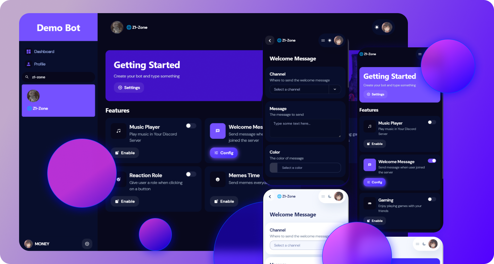
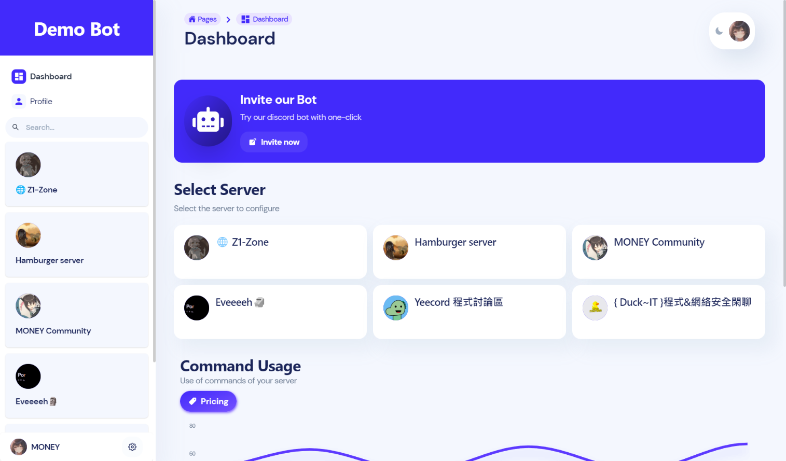
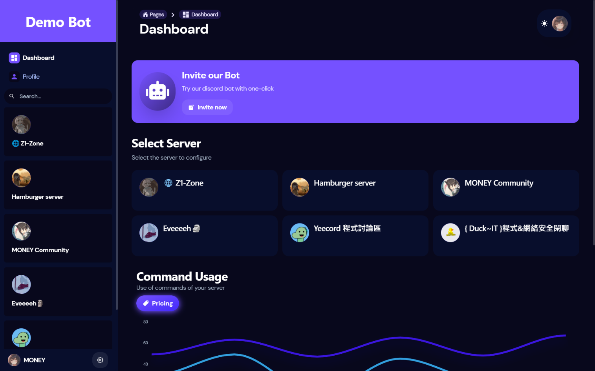

# Discord Bot Dashboard Template

Using Typescript, Next.js 13, React 18 and Chakra ui 2.0

- Support Light/Dark theme
- Multi languages support (i18n)
- Typescript support
- Nice UI & UX + Fast performance
- Flexiable and Customizable
- Detailed Documentation

**Video:** https://youtu.be/IdMPjT5PzVk <br/>
**Live Demo:** https://demo-bot.vercel.app

- Only 'Welcome message' Feature is Supported

## Review (not the latest version)

|                  Light                   |                  Dark                  |
| :--------------------------------------: | :------------------------------------: |
|  |  |

## Getting Started

As a template, you need to customize a few things in order to get it work

### Before that

- Install Node.js, and a Package Manager (ex: npm or pnpm)

### Required Skills

- Basic knowledge about React.js
- Able to read javascript/typescript

### Set up

1. **Clone the repo**
   <br>
   `git clone https://github.com/fuma_nama/discord-bot-dashboard-next.git`
2. **Install dependencies**
   <br>
   We always prefer [`PNpm`](https://pnpm.io)

   |      NPM      |      PNPM      |
   | :-----------: | :------------: |
   | `npm install` | `pnpm install` |

3. **Customize files**
   <br>
   The file structure of this project
   | Path | Description |
   | ------------------------------------- | ------------- |
   | [src/pages/\*](./src/pages) | All the pages |
   | [src/components/\*](./src/components) | Components |
   | [src/api/\*](./src/api) | API utils |
   | [src/config/\*](./src/api) | Common configurations |
4. **Define Features**
   <br>
   The dashboard has built-in support for configuring features
   <br>
   Users are able to enable/disable features and config the feature after enabling it

   **Customize all typings in [src/config/types/custom-types.ts](./src/config/types/custom-types.ts)**
   <br>
   `CustomFeatures` is used for defining features and options, see the example for more details

   **Open [src/config/features](./src/config/features.tsx)**
   <br>
   You can see how a feature is configured

   ```tsx
   'feature-id': {
        name: 'Feature name',
        description: 'Description about this feature',
        icon: <Icon as={BsMusicNoteBeamed} />, //give it a cool icon
        useRender: (data) => {
            //render the form
        },
    }
   ```

   The `useRender` property is used to render Feature Configuration Panel <br>
   Take a look at [here](./src/config/example/WelcomeMessageFeature.tsx) for examples

5. **Configure General Information**
   <br>
   Modify [src/config/common.tsx](./src/config/common.tsx)
   - Bot name & icon
   - Invite url _(example: https://discord.com/oauth2/authorize?client_id=1234&scope=bot)_
   - Guild settings
6. **Configure Environment variables**
   <br>
   Those variables in [.env.example](./.env.example) are required
   <br>
   You can define environment variables by creating a `.env` file
7. **Setup Backend Server**
   <br>
   In order to let the dashboard connected with your discord bot, you will need a backend server
   <br>
   You can implement it in any programming languages

   Read [here](#backend-development) for a guide to develop your own server

8. **Done!**
   <br>
   Start the app by `pnpm run dev` _(depends on your package manager)_
   <br>
   Then you should see the app started in port `3000`

   [Localization](./document/localization.md) | [Forms](./document/form.md)

## Authorization

We are using the [API Routes](https://nextjs.org/docs/api-routes/introduction) of Next.js to handle Authorization

### Configure the Application

1. Open Discord Developer Portal
2. Create your OAuth2 application in https://discord.com/developers/applications
3. In `<Your Application>` -> OAuth2 -> Redirects

   Add `<APP_URL>/api/auth/callback` url to the redirects

   For Example: `http://localhost:3000/api/auth/callback` <br>
   **This is required for Authorization**

### Authorization Flow

**`Login -> Discord OAuth -> API Routes -> Client`**

- Login (`/api/auth/login`)
  <br>
  - Redirects user to discord oauth url
- Open Discord OAuth url
  - User authorizes the application
  - Redirect back to `/api/auth/callback`
- API Routes
  - Store the access token in http-only cookies
  - Redirect back to home page

### Token Expiration

The Discord access token can be expired or unauthorized by the user <br>
We will require the user to login again after getting `401` error from the Discord API

The refresh token won't be used, but you are able to customize the Authorization Flow

## Backend Development

Check [src/api/bot.ts](./src/api/bot.ts), it defined a built-in API for fetching data

You can use `express.js` (Node.js), `Rocket` (Rust) or any libraries/languages to develop your own server
<br>
Usually the server runs along with your discord bot (in the same program)
<br>
Moreover, you can use redis instead of connecting to the bot server directly

### Official Example

[Node.js (Typescript)](https://github.com/fuma-nama/discord-dashboard-backend-next)

### Authorization

The client will pass their access token via the `Authorization` header

```
Bearer MY_TOKEN_1212112
```

### Required Routes

You may extend it for more functions

GET `/guilds/{guild}`

- Get guild info (`custom-types.ts > CustomGuildInfo`)
- **Respond 404 or `null` if bot hasn't joined the guild**

GET `/guilds/{guild}/features/{feature}`

- Get Feature options (`custom-types.ts > CustomFeatures[K]`)
- **Respond 404 if not enabled**

PATCH `/guilds/{guild}/features/{feature}`

- Update feature options
- With custom body (defined in `config/features`)
- Respond updated feature options

POST `/guilds/{guild}/features/{feature}`

- Enable a feature

DELETE `/guilds/{guild}/features/{feature}`

- Disable a feature

GET `/guilds/{guild}/roles`

- Get Roles of the guild
- Responds a list of [Role Object](https://discord.com/developers/docs/topics/permissions#role-object) _(Same as discord documentation)_

GET `/guilds/{guild}/channels`

- Get Channels of the guild
- Responds a list of [Guild Channel](https://discord.com/developers/docs/resources/channel#channel-object) _(Same as discord documentation)_

## Any issues?

Feel free to ask a question by opening a issue

**Love this project?** Give this repo a star!
