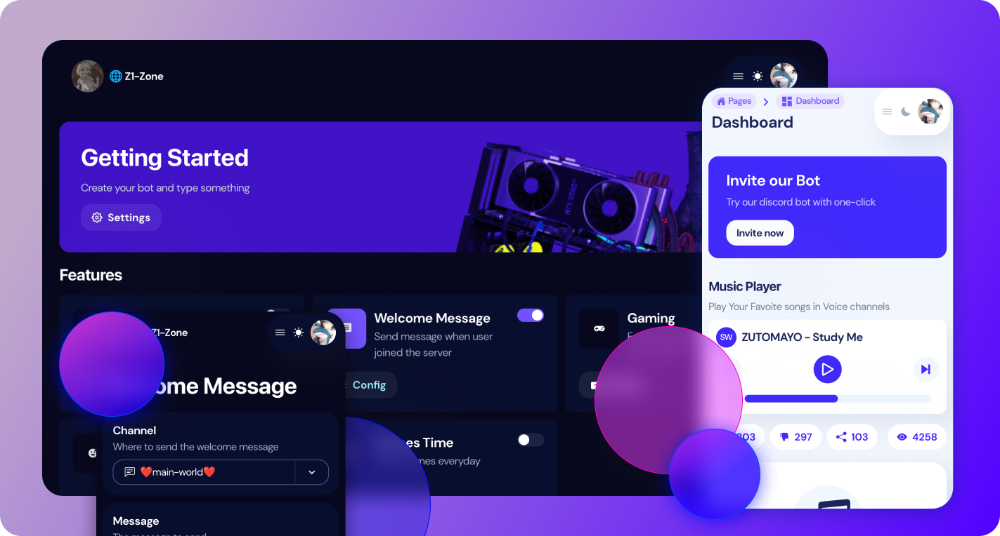

# Modern Discord Bot Dashboard

> This project is still in development

Using typescript, Next.js 13, react 18 and chakra ui 2.0

- Support Light/Dark theme
- Multi languages support (i18n)
- Typescript support
- Nice UI & UX + Fast performance
- Flexiable and Customizable
- Detailed Documentation

**Live Demo:** https://demo-discord-dashboard.vercel.app/

- Only 'Welcome message' Feature is Supported

## Review (not the latest version)

|                  Light                   |                  Dark                  |
| :--------------------------------------: | :------------------------------------: |
|  |  |

## Getting Started

As a template, you need to customize a few things in order to get it work

### Before that

- Install Node.js, and a Package Manager (ex: npm or pnpm)

### Required Skills

- Basic knowledge about React.js
- Able to read javascript/typescript

### Set up

1. **Clone the repo**
   <br>
   `git clone https://github.com/SonMooSans/discord-bot-dashboard-next.git`
2. **Install dependencies**
   <br>
   We always prefer `pnpm`

   |      NPM      |      PNPM      |
   | :-----------: | :------------: |
   | `npm install` | `pnpm install` |

3. **Customize files**
   <br>
   The file structure of this project
   | Path | Description |
   | ------------------------------------- | ------------- |
   | [src/pages/\*](./src/pages) | All the pages |
   | [src/components/\*](./src/components) | Components |
   | [src/api/\*](./src/api) | API utils |
4. **Define Features**
   <br>
   The dashboard has built-in support for configuring features
   <br>
   Users are able to enable/disable features and config the feature after enabling it

   **Customize all typings in [src/config/types/custom-types.ts](./src/config/types/custom-types.ts)**
   <br>
   `CustomFeatures` is used for defining features and options, see the example for more details

   **Open [src/config/features](./src/config/features.tsx)**
   <br>
   You can see how a feature is configured

   ```tsx
   'feature-id': {
        name: 'Feature name',
        description: 'Description about this feature',
        icon: <Icon as={BsMusicNoteBeamed} />, //give it a cool icon
        useRender: (data) => {
            //render the form
        },
    }
   ```

   The `useRender` property is used to render Feature Configuration Panel <br>
   Take a look at [example/MusicFeature.tsx](./src/config/example/WelcomeMessageFeature.tsx) for examples

5. **Configure General Information**
   <br>
   Modify [src/config/common.tsx](./src/config/common.tsx)
   - Bot name & icon
   - Invite url _(example: https://discord.com/oauth2/authorize?client_id=1234&scope=bot)_
   - Guild settings
6. **Configure Environment variables**
   <br>
   Those variables are required: [.env.example](./.env.example)
   <br>
   You can define environment variables by creating a `.env` file
7. **Done!**
   <br>
   Start the app by `pnpm run dev` _(depends on your package manager)_
   <br>
   Then you should see the app started in port `3000`

## The `useForm` hook

We are using [`react-hook-form`](https://react-hook-form.com/) for forms, including feature configuration or settings page

### Built-in Components

There're some common components such as `<FilePicker />` in the [src/components/forms/\*](./src/components/forms) folder

### Controller

We inject `useController` into custom components so as to provides better code quality

Therefore, You don't have to wrap the inputs into the `<Controller />` component

For example, the Color picker & Switch field can be used in this way

```tsx
<ColorPickerForm
  control={{
    label: 'Color',
    description: 'The color of message',
  }}
  controller={{ control, name: 'color' }} //from the useForm hook
/>
```

[Learn More](https://react-hook-form.com/api/usecontroller/)

## Localization

We provide a built-in localizaion utils for you which is light-weight and type-safe

Create the provider

> provider.ts

```typescript
import { initLanguages, initI18n } from '@/utils/i18n';
import { useSettingsStore } from '@/stores';

// Supported languages
export const { languages, names } = initLanguages<'en' | 'cn'>({
  en: 'English',
  cn: '中文',
});

// Create provider and export it
// We need to define how to get the current language
export const provider = initI18n({
  getLang: () => {...},
  useLang: () => {...},
});
```

Create the translation config (Default folder: [src/config/translations](./src/config/translations))

> test.ts

```ts
import { provider } from './provider'; //import the provider
import { createI18n } from '@/utils/i18n';

export const test = createI18n(provider, {
  en: {
    hello: 'Hello',
  },
  cn: {
    hello: '你好',
  },
});
```

Use it in any places

> component.tsx

```tsx
import {test} from '@/config/translations/test'

export function YourComponent() {
  const t = test.useTranslations();

  return <>
   <p>{t.hello}</p>
   <test.T text='hello'>
  </>
}
```

## Authorization

We are using the [API Routes](https://nextjs.org/docs/api-routes/introduction) of Next.js to handle Authorization

Create your OAuth2 application in https://discord.com/developers/applications

**`Login -> Discord OAuth -> API Routes -> Client`**

- Login (`/api/auth/login`)
  <br>
  - Redirects user to discord oauth url
- Open Discord OAuth url
  - User authorizes the application
  - Redirect back to `/auth/callback` _(http://localhost:3000/auth/callback)_
- API Routes
  - Store the access token in http-only cookies
  - Redirect back to home page

## Backend Development

As a frontend template, we doesn't provide an built-in Backend
<br>
Check [src/api/bot.ts](./src/api/bot.ts), it defined a built-in API for fetching data
<br>

### Authorization

The client will pass their access token via the `Authorization` header

```
Bearer MY_TOKEN_1212112
```

### Required Routes

You may extend it for more functions

GET `/guilds/{guild}`

- Get guild info (`custom-types.ts > CustomGuildInfo`)
- **Respond 404 or `null` if bot hasn't joined the guild**

GET `/guilds/{guild}/features/{feature}`

- Get Feature options (`custom-types.ts > CustomFeatures[K]`)
- **Respond 404 if not enabled**

PATCH `/guilds/{guild}/features/{feature}`

- Update feature options
- With custom body (defined in `config/features`)
- Respond updated feature options

POST `/guilds/{guild}/features/{feature}`

- Enable a feature

DELETE `/guilds/{guild}/features/{feature}`

- Disable a feature

GET `/guilds/{guild}/roles`

- Get Roles of the guild
- Responds a list of [Role Object](https://discord.com/developers/docs/topics/permissions#role-object) _(Same as discord documentation)_

GET `/guilds/{guild}/channels`

- Get Channels of the guild
- Responds a list of [Guild Channel](https://discord.com/developers/docs/resources/channel#channel-object) _(Same as discord documentation)_

### Official Example Backend

**Node.js (Typescript):** https://github.com/SonMooSans/discord-bot-dashboard-backend-ts

## Any issues?

Feel free to ask a question by opening a issue

**Love this project?** Give this repo a star!
